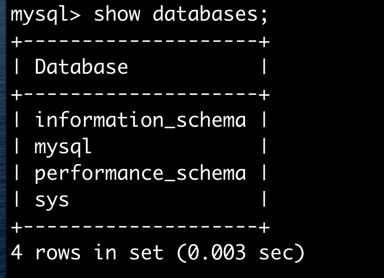

# MAC mysql学习

```shell
brew install mysql #安装

mysql.server start # 启动服务

brew services start mysql #开机自启动
```

### 数据库类型

ROBMS
> mysql 之间有关联 
NON-ROBMS
> redis 数据太大，比如短视频


### SQL

* DDL   定义 CREATE
* DML   操作 INSERT
* DQL   查询 SELECT
* DCL   控制 REVOKE

### 使用图片




