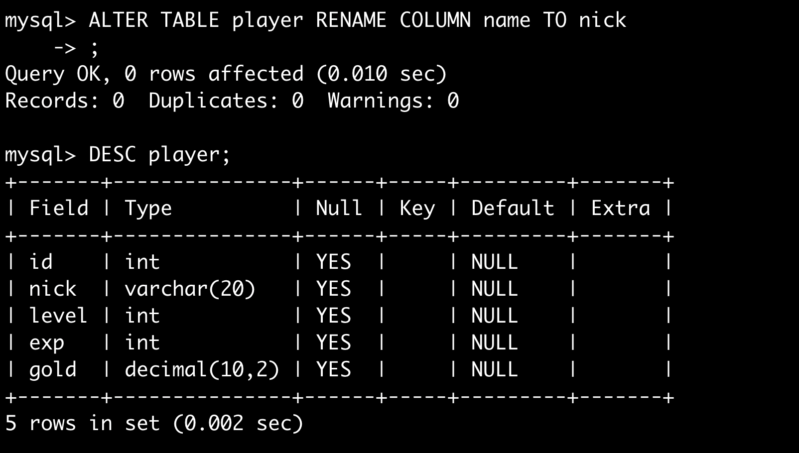

# MySQL（Mac）

## 🚀 快速入门

### 安装与配置
```bash
# 安装 MySQL
brew install mysql

# 启动 MySQL 服务
mysql.server start

# 设置开机自启动
brew services start mysql
```

> ⚠️ 注意事项：
> 1. 安装前建议先执行 `brew search mysql` 确认版本
> 2. 服务启动后可通过 `mysql -u root -p` 进入客户端
> 3. 首次安装需设置 root 密码（使用 `mysql_secure_installation` 工具）

---

## 📚 数据库分类

### 关系型数据库 (RDBMS)
> MySQL 作为典型代表，支持 ACID 特性
- 特点：数据强一致性、支持复杂查询
- 适用场景：金融系统、ERP 等对数据完整性要求高的场景

### 非关系型数据库 (Non-RDBMS)
> Redis 等 NoSQL 系统
- 特点：弱一致性、高并发读写
- 适用场景：缓存系统（如短视频推荐）、日志处理

> 📌 补充：MySQL 与 Redis 的选型对比
> | 特性       | MySQL       | Redis     |
> |------------|-------------|-----------|
> | 存储结构   | 表结构      | 哈希表    |
> | 事务支持   | ✅          | ❌        |
> | 读写性能   | 中等        | 极高      |
> | 适用场景   | 业务数据库  | 缓存系统  |

---

## 📜 SQL 分类详解

| 类型 | 操作 | 示例命令 |
|------|------|----------|
| **DDL** (定义) | 创建/修改/删除数据库/表 | `CREATE TABLE`, `ALTER TABLE`, `DROP DATABASE` |
| **DML** (操作) | 插入/更新/删除数据 | `INSERT INTO`, `UPDATE`, `DELETE FROM` |
| **DQL** (查询) | 数据检索 | `SELECT * FROM table` |
| **DCL** (控制) | 权限管理 | `GRANT`, `REVOKE` |

> ✅ 建议：掌握 `EXPLAIN` 分析查询计划，使用 `DESCRIBE table_name` 查看表结构

---

## 🖼️ 实战操作图示

### 📁 数据库管理

*数据库列表与连接配置*


*表结构展示与数据操作*

### 🛠️ 表结构操作

*创建表语句示例*


*`DESCRIBE` 命令查看表结构*

### 🔁 数据修改

*修改列类型示例*


*重命名列操作*


*添加新列的 SQL 语句*

---


